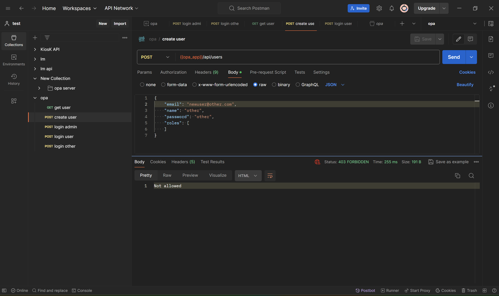

# OPA implementation on python app

## Requirement

This opa implementation need opa server to be set up. See https://github.com/mhseptiadi/opa

## Installation

### Install minikube 

Please refer to https://minikube.sigs.k8s.io/docs/start/

---

### Build docker

#### Set to use docker on minikube:

For linux & mac:
```shell
eval $(minikube docker-env)
```

For windows using powershell:
```shell
& minikube -p minikube docker-env --shell powershell | Invoke-Expression
```

#### Build the dockerfile
```shell
docker build -f Dockerfile -t opa-py:latest .
```

---

### Create ssl certificate

Run these one by one to create ssl certificate
```shell
openssl genrsa -des3 -out server.key 2048
```
```shell
openssl req -new -key server.key -out server.csr
```
```shell
cp server.key server.key.org
```
```shell
openssl rsa -in server.key.org -out server.key
```
```shell
openssl x509 -req -days 365 -in server.csr -signkey server.key -out server.crt
```

---

### Set ssl certificate to configmap
We only need server.crt and server.key to configmap
```shell
kubectl create configmap server-crt --from-file ./server.crt
```
```shell
kubectl create configmap server-key --from-file ./server.key
```

---

### Deploy to minikube

#### Deploy the yaml
```shell
kubectl apply -f deploy.yaml
```

#### Open url for testing
```shell
minikube service opa-py --url --https
```

---

## Api test

The return of minikube url will be something like `{host}:{port}`, for example https://127.0.0.1:55738
. Then we can use this for our testing.

There are 3 users for this testing:
```shell
[
    {
        "email": "user@user.com",
        "name": "user",
        "password": "admin",
        "roles": [
            "user"
        ]
    },
    {
        "email": "admin@admin.com",
        "name": "admin",
        "password": "admin",
        "roles": [
            "admin"
        ]
    },
    {
        "email": "other@other.com",
        "name": "other",
        "password": "other",
        "roles": [
        ]
    }
]
```

There are 3 api endpoints for this testing:

- Login API
- Get Users (admin and user role)
- Create Users (only admin role)


### First, Use Login API
Login admin (admin@admin.com) that has crud privilege on users endpoint
```shell
curl --location 'https://127.0.0.1:55738/api/login' \
--header 'Content-Type: application/json' \
--data-raw '{
    "email": "admin@admin.com",
    "password": "admin"
}'
```

Login user (user@user.com) that has only read users endpoint
```shell
curl --location 'https://127.0.0.1:55738/api/login' \
--header 'Content-Type: application/json' \
--data-raw '{
    "email": "user@user.com",
    "password": "user"
}'
```

Login other (other@other.com) that does not have any privilege
```shell
curl --location 'https://127.0.0.1:55738/api/login' \
--header 'Content-Type: application/json' \
--data-raw '{
    "email": "other@other.com",
    "password": "other"
}'
```

### Get Users api
From the login api above you will get authorization bearer. Copy the bearer and use it on get users api.

```shell
curl --location 'https://127.0.0.1:55738/api/users' \
--header 'Authorization: {{bearer}}'
```

Both `admin` and `user` can access this endpoint because they have role admin and user. The last user `other` cannot access this endpoint because he doesn't have access.


### Create User api

The same like before, copy the bearer from login and use it in this api.

```shell
curl --location 'https://127.0.0.1:55738/api/users' \
--header 'Authorization: {{bearer}}' \
--header 'Content-Type: application/json' \
--data-raw '{
    "email": "user2@user2.com",
    "name": "user2",
    "password": "user2",
    "roles": [
        "user2"
    ]
}'
```

In this create user api, only `admin` can have access.

### Import postman
For testing purpose, you can import `opa.postman_collection.json` postman. You need to add environment as login will save bearer to environment.

#### Login as an admin 
- First login as admin

- Then try get users endpoint, you will have access on it

- Then try create users endpoint, you still have access


#### Login as normal user
- Second, try login as normal user

- Then try get users endpoint, you will have access on it

- Then try create users endpoint, you will have no access


#### Login as other user
- Last, try login as other user that does not have any privilege

- Then try get users endpoint, you will have no access

- Then try create users endpoint, you will have no access

